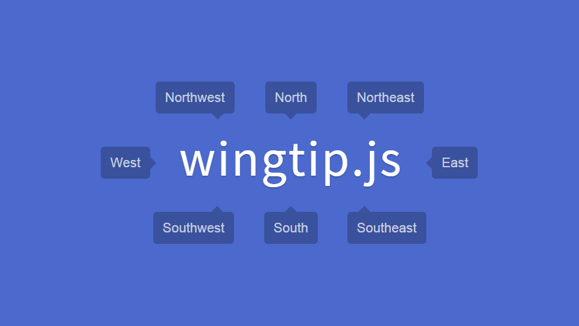

*wingtip.js is no longer being developed. Such a simple implementation is possible using only CSS.*
# wingtip.js.
### Absurdly simple javascript tooltips.


wingtip.js is a pure javascript plugin for displaying simple tooltips. Inspired by [Tipsy](https://github.com/jaz303/tipsy "Tipsy").
*Supports IE8+, Chrome 4+, Firefox 3.5+, Opera 10.0+, Safari 3.1+*
* * *
### Usage

1.  ##### In your HTML, load `wingtip.min.css` and `wingtip.min.js` as such
    ```html
    <link rel="stylesheet" href="wingtip.min.css">
    <script src="wingtip.min.js"></script>
    ```
    create some tooltipped elements that have:
    *   the class `js-wingtip`
    *   a data attribute `wingtip` with a value of `n, s, e, w, ne, nw, se, or sw`; the direction of the tooltip
    *   a second attribute that contains the tooltip's content, I like to use the `title` attribute.
        *You can choose any attribute you want, simply set it in the options*

    *e.g.:*
    ```html
    <a href="#!" class="js-wingtip" data-wingtip="n" title="I'm a northerly tooltip!">I'm tooltipped, yo!</a>
    ```

2.  ##### In your Javascript, call the `wingtip` function after the DOM is ready.
```javascript
// IE9+
document.addEventListener('DOMContentLoaded', function() {
    // call wingtip with default options
    wingtip();
    // or set some wingtip options
    wingtip(options = {
        offset: 5,
        title: 'aria-label'
    });
});
```

    ###### Options

    | Option        | Description                                                           | Default Value|
    | ------------- |:----------------------------------------------------------------------|:------------:|
    | offset        | the distance in pixels the tooltip is offset from the calling element | 0            |
    | title         | the attribute from which the tooltip's content is retrieved           | 'title'      |

3. ##### Enjoy!
